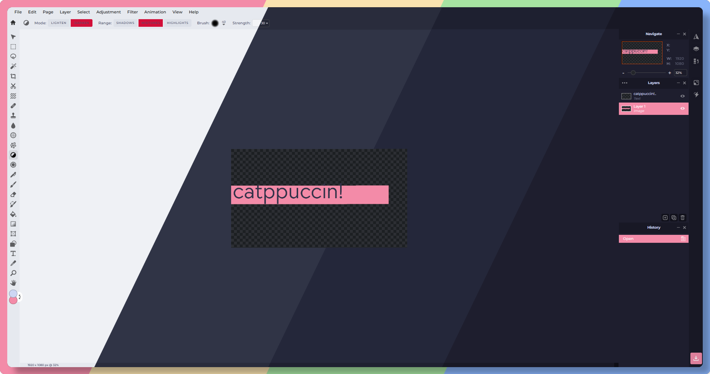
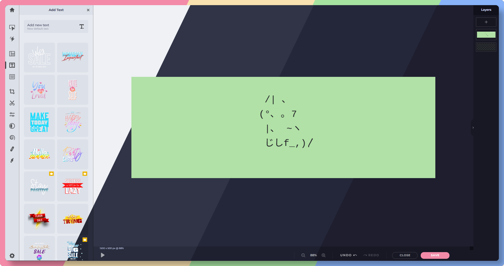

<h3 align="center">
	 
	
	Catppuccin for <a href="https://pixlr.com">Pixlr E/X</a>
	
</h3>

	
	
    

	
    

## Usage

#### Stylus
1. Install Stylus [Firefox](https://addons.mozilla.org/en-GB/firefox/addon/styl-us/)/[Chrome](https://chrome.google.com/webstore/detail/stylus/clngdbkpkpeebahjckkjfobafhncgmne) extension.
2. Enable CSP Patching from Stylus Settings > Advanced.
3. [Click here to install for Pixlr E](https://raw.githubusercontent.com/vanillyn/catppuccin-userstyles/main/styles/Pixlr/themes/pixlr-e-catppuccin.user.css)
4. [Click here to install for Pixlr X](https://raw.githubusercontent.com/vanillyn/catppuccin-userstyles/main/styles/Pixlr/themes/pixlr-x-catppuccin.user.css)

#### Stylish
1. Install Stylish [Firefox](https://addons.mozilla.org/en-GB/firefox/addon/stylish/)/[Chrome](https://chrome.google.com/webstore/detail/stylish-custom-themes-for/fjnbnpbmkenffdnngjfgmeleoegfcffe) extension.
2. Create a new custom Style that applies to `pixlr.com/e` or `/x`.
3. Copy content of [pixlr-e/x-catppuccin.user.css](themes) and paste to created Style.

## 💝 Thanks to

- [Vanillyn](https://github.com/vanillyn)

&nbsp;

Copyright &copy; 2021-present <a href="https://github.com/catppuccin" target="_blank">Catppuccin Org</a>

